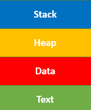

[Home](../README.md)

### What is a Process?  
**Process** is the execution of a program that performs the actions specified in
 that program. It can be defined as an execution unit where a program runs.
 The OS helps you to create, schedule, and terminates the processes which is
 used by CPU. A process created by the main process is called a child process.
 
**Architecture diagram of the Process**  

* Stack: The Stack contains the temporary data, such as function parameters,
 returns addresses, and local variables.
* Heap: Dynamically allocated memory to process during its run time.
* Data: Contains the global variable.
* Text: A Process, sometimes known as the Text Section, also includes the
 current activity represented by the value of the Program Counter.
 
**Attributes or Characteristics of a Process**  
A process has following attributes.
```markdown
1. Process Id               : A unique identifier assigned by the operating system
2. Process State            : Can be ready, running, etc.
3. CPU registers            : Like the Program Counter (CPU registers must be saved and restored when a process is
                              swapped in and out of CPU)
5. Accounts information     :
6. I/O status information   : For example, devices allocated to the process, open files, etc
8. CPU scheduling information: For example, Priority (Different processes may have different priorities, for example
                               a short process may be assigned a low priority in the shortest job first scheduling) 
```
**States of Process**  
A process is in one of the following states:

```markdown
1. New              : Newly Created Process (or) being-created process.
2. Ready            : After creation process moves to Ready state, i.e. the process is ready for execution.
3. Run              : Currently running process in CPU (only one process at a time can be under execution in 
                      a single processor).
4. Wait/Block       : When a process requests I/O access.
5. Complete/Terminated: The process completed its execution.
6. Suspended Ready  : When the ready queue becomes full, some processes are moved to suspended ready state
7. Suspended Block  : When waiting queue becomes full.
```


References:
* [Guru99](https://www.guru99.com/process-management-pcb.html)
* [GeeksforGeeks](https://www.geeksforgeeks.org/introduction-of-process-management/)